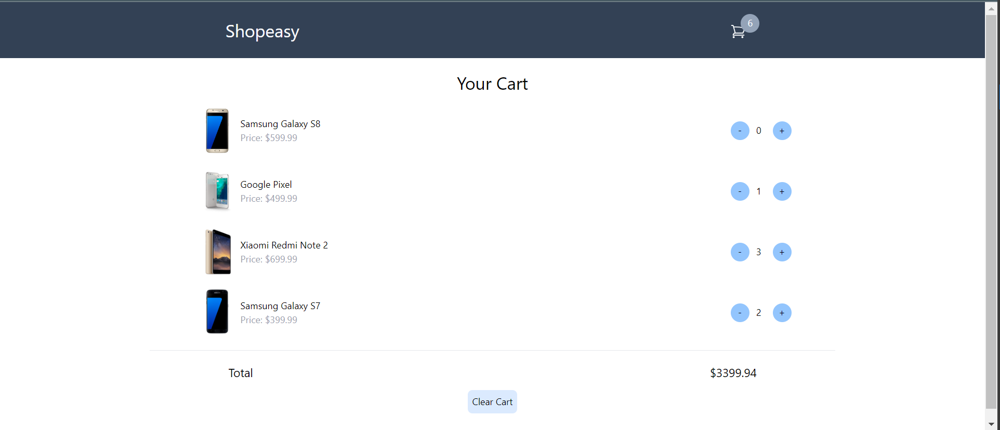

# Shopping Cart Project

This project is a simple shopping cart application built with React and Vite.

## Features

- Add items to the cart
- Remove items from the cart
- Display total price of items in the cart
- Display count of items in the cart

## Technologies Used

- [React](https://react.dev/learn)
  - [React Hooks](https://react.dev/reference/react/hooks)
  - [Context API](https://react.dev/reference/react/createContext)
- [Vite](https://vitejs.dev/guide/)

## Live Demo

You can see the live demo of this project here (Github pages): https://anubhav-nagar.github.io/cart/

